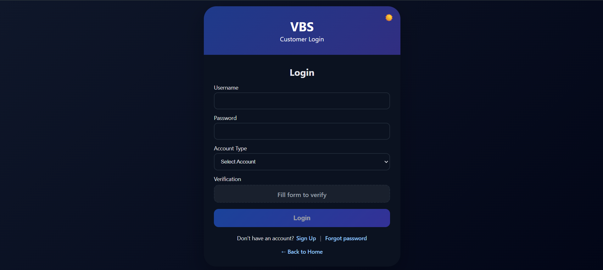
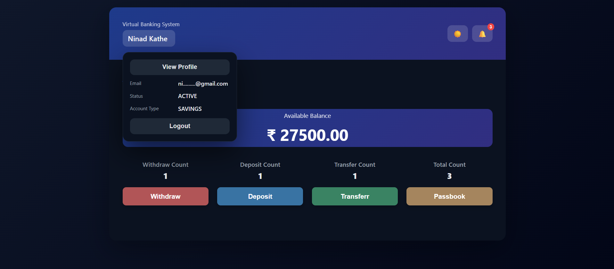
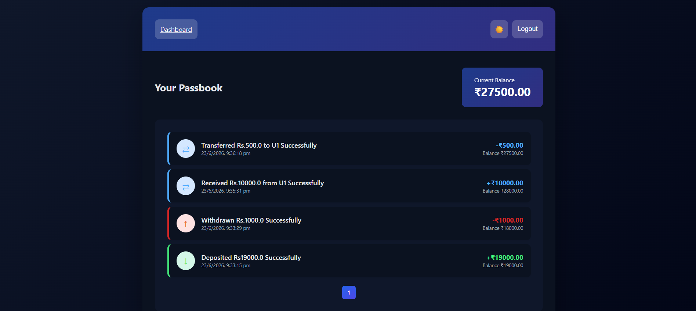
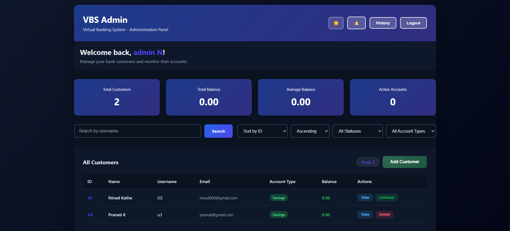
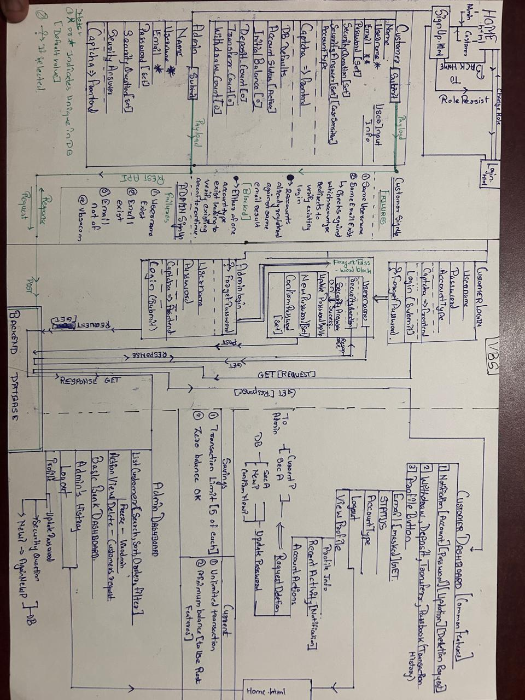

# Virtual Banking System

[](https://spring.io/projects/spring-boot)
[](https://www.oracle.com/java/)
[](https://www.mysql.com/)
[](https://maven.apache.org/)

---

## Short Description

Virtual Banking System is a Spring Boot application that simulates core online banking workflows for both customers and administrators. It demonstrates backend development with Java, MySQL, Spring Data JPA, and Hibernate, along with a static HTML, CSS, and JavaScript frontend. The project focuses on account handling, transaction processing, and REST-based communication between the browser and backend.

---

## Motivation

This project was built to practice designing a complete banking-style application with separate customer and admin workflows in one codebase. It brings together account creation, balance management, transaction history, notifications, and administrative controls in a way that reflects how a small backend system is structured.

## Solution

The application uses REST APIs backed by Spring Data JPA and MySQL to manage customer and admin operations. Both modules work on the same underlying data model while handling their own flows for sign-up, login, account management, deposits, transfers, notifications, and account administration through the static frontend pages.

---

## Features

- Customer authentication with sign-up and login
- Admin authentication with sign-up and login
- Account dashboard and profile details
- Deposit, withdrawal, and fund transfer
- Passbook / transaction history
- Notifications for account activity and admin actions
- Password recovery using security questions
- Password update from the profile flow
- Admin customer management: add users, search and filter users, freeze and unfreeze accounts, and delete users with balance checks
- Account deletion request flow for customers
- Startup routine that resets transaction counters for the demo month simulation

## Screenshots

- Login  
  

- Dashboard  
  

- Transactions  
  

- Admin Panel  
  

## System Architecture

<p align="center">
  
</p>

---

## Tech Stack

- Backend: Spring Boot 3.5.9
- Language: Java 17
- Persistence: Spring Data JPA / Hibernate
- Database: MySQL
- Build tool: Maven
- Utility library: Lombok
- Frontend: Static HTML, CSS, and JavaScript pages served from `src/main/resources/static`

## Project Architecture

The codebase follows a simple layered REST architecture:

- `controller` - Handles HTTP requests and REST endpoints.
- `dto` - Request and response payloads.
- `models` - JPA entities.
- `repos` - Spring Data JPA repositories.
- `config` - Application configuration and startup logic.
- `static` - HTML, CSS, and JavaScript frontend.

---

## Folder Structure

```text
.
|-- pom.xml
|-- mvnw
|-- mvnw.cmd
|-- assets
|   `-- arch.jpg
`-- src
    |-- main
    |   |-- java
    |   |   `-- com/vbs/demo
    |   |       |-- config
    |   |       |-- controller
    |   |       |-- dto
    |   |       |-- models
    |   |       `-- repos
    |   `-- resources
    |       |-- application.properties
    |       `-- static
    |           |-- admin.html
    |           |-- adminhistory.html
    |           |-- dashboardf-.html
    |           |-- dashboardf.html
    |           |-- forgot-passwordf.html
    |           |-- homef.html
    |           |-- loginf.html
    |           |-- passbookf.html
    |           |-- signupf.html
    |           |-- theme.js
    |           `-- view-profilef.html
    `-- test
        `-- java
            `-- com/vbs/demo
                `-- VbsApplicationTests.java
```

---

## Installation

1. Install JDK 17.
2. Install and start MySQL.
3. Create a database named `vbsdb` or update the database name in `application.properties`.
4. Open the project in your IDE or terminal.
5. Ensure the Maven wrapper is available in the repository root.
6. Update the database credentials in `src/main/resources/application.properties`.

## Configuration

Edit `src/main/resources/application.properties` before running the app:

- `spring.datasource.url` should point to your MySQL database
- `spring.datasource.username` should match your MySQL user
- `spring.datasource.password` should match your MySQL password
- `spring.jpa.hibernate.ddl-auto=update` keeps the schema in sync during development
- `server.port=8082` sets the application port

Example:

```properties
spring.datasource.url=jdbc:mysql://localhost:3306/vbsdb
spring.datasource.username=root
spring.datasource.password=your-password
server.port=8082
```

## Running the Project

Run the application with the Maven wrapper:

```bash
# Windows
mvnw.cmd spring-boot:run

# macOS / Linux
./mvnw spring-boot:run
```

After startup, open the application on port `8082`. The static pages in `src/main/resources/static` are served by Spring Boot.

---

## API Overview

The backend APIs are grouped into the following modules:

- Authentication: customer and admin sign-up, login, and password recovery
- Customer: dashboard details, profile access, password update, and account deletion request
- Transactions: deposit, withdrawal, transfer, and passbook history
- Notifications: customer notifications, admin notifications, and recent activity
- Admin: add users, search and filter users, freeze and unfreeze users, and delete users

---

## Possible Future Improvements

- BCrypt password hashing
- Spring Security integration
- Better validation
- Centralized exception handling
- Docker support

## What I Learned

I built practical experience with Spring Boot, REST APIs, Spring Data JPA, Hibernate, MySQL, DTOs, CRUD application design, frontend-backend integration, and Maven. The project also helped me understand how to organize entities, repositories, controllers, and static UI pages into a working full-stack-style application.

---

## Disclaimer

This project was developed for educational purposes to explore backend application development and banking workflows. It is intended to demonstrate software engineering concepts and is not designed for production banking use.

---

## License

MIT License

## Author

Author: Ninad Kathe


